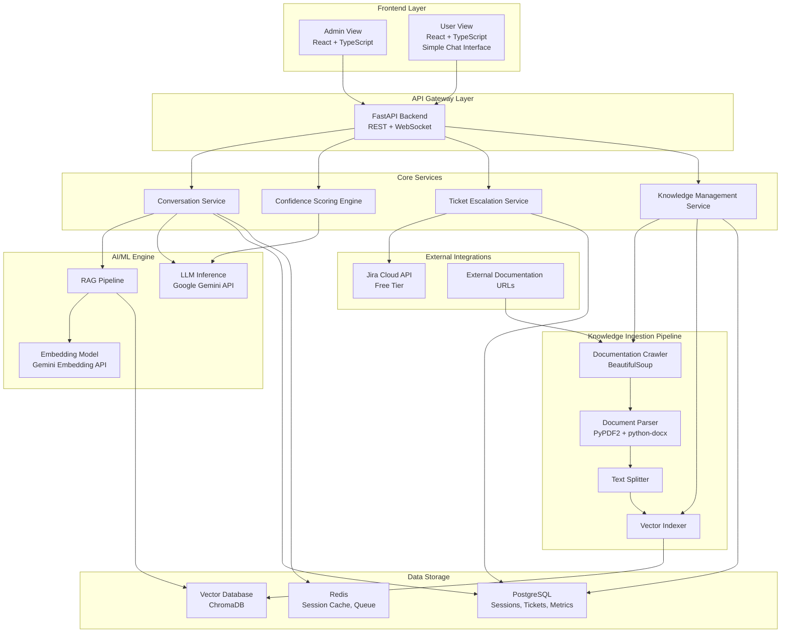
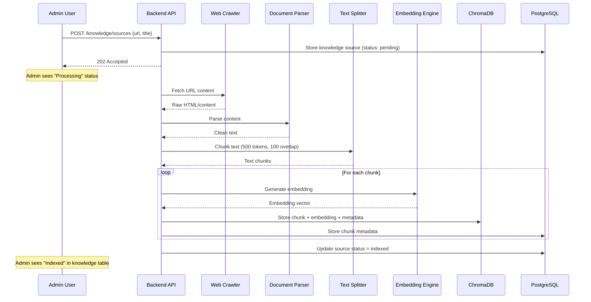
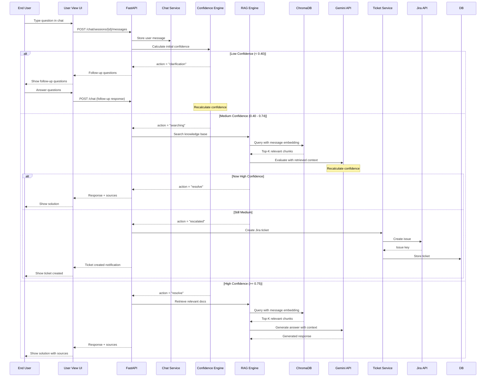
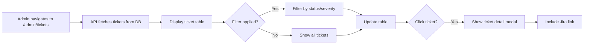
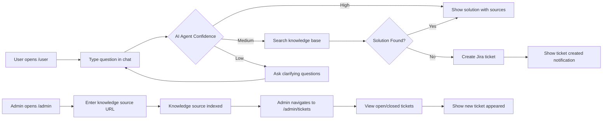

# AI-Powered L2 Support Copilot — Architecture Document

## Version: 1.0 | Date: 2026-05-09 | Status: Draft for Hackathon

---

## 1. Executive Summary

This document outlines the architecture for an **AI-Powered L2 Support Copilot** — an on-device, enterprise-ready system that enables L2 support teams to resolve known customer issues faster through intelligent document understanding, contextual conversations, confidence-based decision-making, and automated ticket escalation.

The architecture is designed for a **24-hour hackathon demo** with a team of 8 (4 backend, 2 frontend, 1 tester, 1 DevOps), prioritizing rapid development, clear separation of concerns, and a demonstrable end-to-end workflow.

### 1.1 Dual-View Architecture

The system provides **two distinct user experiences**:

| View | User Type | Primary Functions |
|------|-----------|-------------------|
| **Admin View** | Support Managers / Knowledge Owners | Enter knowledge source URLs, manage knowledge base ingestion, view open/closed Jira tickets, monitor system metrics |
| **User View** | End Users / Customers | Interact with a simple chat interface to ask questions about known issues and receive AI-powered responses |

This separation ensures that:
- **Admins** have a focused workspace for knowledge management and ticket oversight
- **Users** have a streamlined, distraction-free chat experience for getting answers

### 1.2 AI Agent Confidence Flow (User View)

The User View chat interface hides internal confidence scores from the end user. The AI agent uses confidence internally to determine the next action:

```
User Query → AI Agent Calculates Confidence Score
    │
    ├─ Low Confidence → Agent asks clarifying questions → Back-and-forth with user
    │       │
    │       └─ Once confidence reaches Medium → Proceed to knowledge base search
    │
    ├─ High Confidence (solution found) → Return answer from knowledge base to user
    │
    └─ No Solution Found → Auto-create Jira ticket
```

Key principles:
- **Confidence scores are internal** — users never see them
- **Low confidence** triggers clarifying questions, not ticket creation
- **Medium confidence** triggers knowledge base search
- **High confidence** returns the solution to the user
- **No solution found** triggers Jira ticket creation

---

## 2. System Overview

### 2.1 High-Level Architecture



---

## 3. Tech Stack Selection & Justification

### 3.1 Backend

| Component | Technology | Justification |
|-----------|-----------|---------------|
| **API Framework** | Python FastAPI | Async-native, auto-generated OpenAPI docs, excellent performance, rapid development. Ideal for hackathon timelines. |
| **Language** | Python 3.11+ | Dominant in AI/ML ecosystem. Rich libraries for NLP, RAG, web scraping, and API development. All team members are backend engineers. |
| **LLM Inference** | Google Gemini API (gemini-2.0-flash) | Cloud-hosted, no local GPU required. Gemini 2.0 Flash provides fast, high-quality responses with excellent reasoning capabilities. Generous free tier for hackathon usage. Built-in function calling for structured ticket generation. |
| **Embedding Model** | `text-embedding-004` (Gemini Embedding API) | Native Gemini embedding model. Produces 768-dim embeddings. Consistent with the LLM provider, reducing integration complexity. Pay-per-use pricing with free tier. |
| **Task Library** | LangChain | Provides RAG pipeline abstractions, document loaders, chain composition. Accelerates development of the retrieval and generation pipeline. Native Gemini integration available. |

### 3.2 Frontend

The frontend consists of **two separate views** accessible through different routes:

| Component | Technology | Justification |
|-----------|-----------|---------------|
| **Framework** | React 18 + TypeScript | Component-based architecture, large ecosystem. TypeScript provides type safety. 2 dedicated frontend engineers on the team. |
| **UI Component Library** | shadcn/ui | Modern, accessible, copy-paste components. Built on Tailwind CSS. Fast development with professional-looking results. |
| **Styling** | Tailwind CSS | Utility-first CSS. Rapid prototyping. Consistent design system. |
| **State Management** | Zustand | Lightweight, minimal boilerplate. Better than Redux for a hackathon-scale app. |
| **Routing** | React Router v6 | Client-side routing to switch between Admin View and User View. |

#### 3.2.1 User View (`/user`)

A simple, clean chat interface where end users can ask questions and receive AI-powered responses.

| Feature | Description |
|---------|-------------|
| **Chat Interface** | Minimalist chat UI with message input and response display |
| **Real-time Responses** | WebSocket-based streaming for live responses from the AI agent |
| **Conversation History** | Previous conversations stored and accessible |
| **Ticket Notification** | Visual indicator when a Jira ticket is auto-created |

#### 3.2.2 Admin View (`/admin`)

A comprehensive dashboard for administrators to manage knowledge sources and monitor tickets.

| Feature | Description |
|---------|-------------|
| **Knowledge Source Entry** | Form to enter URLs of knowledge sources (documentation, FAQs, etc.) |
| **Knowledge Base Dashboard** | Table showing all knowledge sources with status (pending, processing, indexed, error) |
| **Ticket Dashboard** | Table showing all open/closed Jira tickets with filtering and sorting |
| **Ticket Details** | Click to view full ticket details including Jira link |

### 3.3 AI/ML Infrastructure

| Component | Technology | Justification |
|-----------|-----------|---------------|
| **Vector Database** | ChromaDB | Embedded vector database. No separate server needed. Perfect for on-device deployment. Supports metadata filtering, cosine similarity. Python-native. |
| **Document Storage** | Local filesystem + PostgreSQL | Raw documents stored locally. Metadata, embeddings references, and processed content in PostgreSQL. |
| **Caching** | Redis (Docker) | Session state caching, rate limiting, task queue for async document ingestion. |

### 3.4 Data Storage

| Component | Technology | Justification |
|-----------|-----------|---------------|
| **Primary Database** | PostgreSQL 15 | Relational data: users, sessions, tickets, metrics. JSONB support for flexible ticket data. Extensive ecosystem. |
| **Session Cache** | Redis 7 | In-memory caching for active chat sessions. Fast lookups for conversation history. |
| **Vector Store** | ChromaDB | Persistent vector storage with embeddings. Supports persistence to disk for on-device deployment. |

### 3.5 DevOps & Deployment

| Component | Technology | Justification |
|-----------|-----------|---------------|
| **Containerization** | Docker + Docker Compose | Single-command deployment of all services. Reproducible environment. 1 DevOps engineer can manage. |
| **Local Development** | uv (Python) + pnpm (Node) | Fast Python package management and Node package management. |
| **Monitoring** | Prometheus + Grafana (optional) | For demo purposes, basic logging and dashboard metrics suffice. |

### 3.6 External Integrations

| Component | Technology | Justification |
|-----------|-----------|---------------|
| **Ticket Management** | Jira Cloud API (Free Tier) | Free up to 10 users. REST API available. Standard tool in enterprise environments. |
| **Documentation Source** | HTTP + BeautifulSoup/Scrapy | Web scraping for product documentation URLs. Handles HTML content extraction. |

---

## 4. Detailed Component Architecture

### 4.1 Service Breakdown

#### 4.1.1 FastAPI Backend (`/backend`)

```
backend/
├── main.py                 # Application entry point
├── config/
│   ├── settings.py         # Configuration management
│   └── database.py         # Database connection
├── api/
│   ├── v1/
│   │   ├── router.py       # Main API router
│   │   ├── chat.py         # Chat endpoints (REST + WebSocket)
│   │   ├── knowledge.py    # Knowledge base management
│   │   ├── tickets.py      # Ticket CRUD + escalation
│   │   └── analytics.py    # Dashboard metrics
│   └── dependencies.py     # Shared dependencies
├── services/
│   ├── chat_service.py     # Conversation management
│   ├── rag_service.py      # RAG pipeline orchestration
│   ├── confidence_service.py # Confidence scoring
│   └── ticket_service.py   # Jira ticket creation
├── ai/
│   ├── llm_engine.py       # Google Gemini LLM interface
│   ├── embedding_engine.py # Embedding generation
│   └── rag_pipeline.py     # RAG chain implementation
├── models/
│   ├── database.py         # SQLAlchemy models
│   ├── chat.py             # Chat request/response schemas
│   ├── ticket.py           # Ticket schemas
│   └── analytics.py        # Analytics schemas
├── utils/
│   ├── text_splitter.py    # Document chunking
│   ├── web_scraper.py      # Documentation crawler
│   └── jira_client.py      # Jira API wrapper
└── tests/
    ├── test_chat.py
    ├── test_rag.py
    └── test_tickets.py
```

#### 4.1.2 Frontend Application (`/frontend`)

The frontend is organized into two separate view directories, each with its own routing and state management.

```
frontend/
├── src/
│   ├── main.tsx            # Application entry point
│   ├── App.tsx             # Root component + routing (Admin/User views)
│   ├── config/
│   │   └── api.ts          # API configuration
│   ├── views/
│   │   ├── admin/          # Admin View
│   │   │   ├── AdminLayout.tsx       # Admin layout wrapper
│   │   │   ├── KnowledgePage.tsx     # Knowledge source management
│   │   │   │   ├── AddSourceForm.tsx # Form to enter knowledge URL
│   │   │   │   └── SourceList.tsx    # Table of all knowledge sources
│   │   │   ├── TicketsPage.tsx       # Ticket dashboard
│   │   │   │   ├── TicketTable.tsx   # Open/closed tickets list
│   │   │   │   ├── TicketFilter.tsx  # Filter by status, severity
│   │   │   │   └── TicketDetail.tsx  # Ticket detail modal
│   │   │   └── AdminDashboard.tsx    # Overview metrics
│   │   └── user/         # User View
│   │       ├── UserLayout.tsx        # User layout wrapper (minimal)
│   │       ├── ChatPage.tsx          # Main chat interface
│   │       │   ├── ChatWindow.tsx    # Message display area
│   │       │   ├── MessageInput.tsx  # Chat input field
│   │       │   └── MessageBubble.tsx # Individual message component
│   │       └── TicketNotification.tsx # Notification when ticket created
│   ├── components/
│   │   ├── common/
│   │   │   ├── Header.tsx
│   │   │   ├── LoadingSpinner.tsx
│   │   │   └── ErrorBoundary.tsx
│   │   └── knowledge/
│   │       ├── SourceCard.tsx
│   │       └── StatusBadge.tsx
│   ├── hooks/
│   │   ├── admin/
│   │   │   ├── useKnowledgeSources.ts # Knowledge source data fetching
│   │   │   └── useTickets.ts          # Ticket data fetching
│   │   └── user/
│   │       ├── useChat.ts             # Chat session management
│   │       └── useWebSocket.ts        # WebSocket connection
│   ├── stores/
│   │   ├── adminStore.ts     # Admin view state
│   │   └── userStore.ts      # User view state
│   ├── types/
│   │   └── index.ts          # TypeScript type definitions
│   └── utils/
│       ├── api.ts            # API client
│       └── formatters.ts     # Data formatting utilities
├── public/
├── package.json
├── tailwind.config.ts
├── tsconfig.json
└── vite.config.ts
```

#### 4.1.3 Infrastructure (`/infra`)

```
infra/
├── docker-compose.yml      # Service orchestration
├── Dockerfile.backend      # Backend container
├── Dockerfile.frontend     # Frontend container
├── Dockerfile.ollama       # Removed — Gemini API is cloud-hosted
├── nginx/
│   └── nginx.conf          # Reverse proxy config
└── scripts/
    ├── init_db.sql         # Database initialization
    └── seed_data.sql       # Demo seed data
```

---

### 4.2 Data Models

#### 4.2.1 Core Entities

```
┌─────────────────────────────────────────────────────────────────┐
│                         USER                                     │
├─────────────────────────────────────────────────────────────────┤
│ id: UUID (PK)                                                   │
│ username: VARCHAR(100)                                          │
│ email: VARCHAR(255)                                             │
│ role: ENUM(agent, manager, admin)                               │
│ created_at: TIMESTAMP                                           │
└─────────────────────────────────────────────────────────────────┘

┌─────────────────────────────────────────────────────────────────┐
│                       SESSION                                    │
├─────────────────────────────────────────────────────────────────┤
│ id: UUID (PK)                                                   │
│ user_id: UUID (FK -> User)                                      │
│ title: VARCHAR(255)                                             │
│ status: ENUM(active, resolved, escalated)                       │
│ created_at: TIMESTAMP                                           │
│ updated_at: TIMESTAMP                                           │
└─────────────────────────────────────────────────────────────────┘

┌─────────────────────────────────────────────────────────────────┐
│                       MESSAGE                                    │
├─────────────────────────────────────────────────────────────────┤
│ id: UUID (PK)                                                   │
│ session_id: UUID (FK -> Session)                                │
│ role: ENUM(user, assistant, system)                             │
│ content: TEXT                                                   │
│ confidence_score: FLOAT (nullable)                              │
│ sources: JSONB (nullable)                                       │
│ created_at: TIMESTAMP                                           │
└─────────────────────────────────────────────────────────────────┘

┌─────────────────────────────────────────────────────────────────┐
│                       TICKET                                     │
├─────────────────────────────────────────────────────────────────┤
│ id: UUID (PK)                                                   │
│ jira_issue_key: VARCHAR(50) (nullable)                          │
│ jira_issue_id: VARCHAR(100) (nullable)                          │
│ session_id: UUID (FK -> Session)                                │
│ summary: TEXT                                                   │
│ description: TEXT                                               │
│ severity: ENUM(low, medium, high, critical)                     │
│ status: ENUM(open, in_progress, resolved, closed)               │
│ product_module: VARCHAR(255)                                    │
│ environment: TEXT                                               │
│ error_messages: TEXT                                            │
│ steps_to_reproduce: TEXT                                        │
│ troubleshooting_attempted: TEXT                                 │
│ conversation_summary: TEXT                                      │
│ doc_references: JSONB                                           │
│ created_at: TIMESTAMP                                           │
│ updated_at: TIMESTAMP                                           │
└─────────────────────────────────────────────────────────────────┘

┌─────────────────────────────────────────────────────────────────┐
│                   KNOWLEDGE_SOURCE                               │
├─────────────────────────────────────────────────────────────────┤
│ id: UUID (PK)                                                   │
│ url: VARCHAR(500)                                               │
│ title: VARCHAR(500)                                             │
│ source_type: ENUM(web_page, pdf, docx, markdown)                │
│ status: ENUM(pending, processing, indexed, error)               │
│ chunk_count: INTEGER                                            │
│ last_indexed_at: TIMESTAMP                                      │
│ created_at: TIMESTAMP                                           │
└─────────────────────────────────────────────────────────────────┘

┌─────────────────────────────────────────────────────────────────┐
│                      METRIC                                      │
├─────────────────────────────────────────────────────────────────┤
│ id: UUID (PK)                                                   │
│ metric_type: ENUM(query_count, resolution_count, escalation_... │
│ date: DATE                                                      │
│ value: INTEGER                                                  │
│ metadata: JSONB (nullable)                                      │
│ recorded_at: TIMESTAMP                                          │
└─────────────────────────────────────────────────────────────────┘
```

---

## 5. Core Workflows

### 5.1 Knowledge Ingestion Pipeline (Admin View)

Admin enters a knowledge source URL, and the system ingests the content into the vector database.



### 5.2 Chat Interaction (User View)

User asks a question through a simple chat interface. The AI agent internally calculates confidence and determines the next action.



### 5.3 Admin View — Ticket Dashboard

Admin views all open and closed Jira tickets.



---

## 6. API Design

The API serves both Admin View and User View. Endpoints are organized by functionality rather than view.

### 6.1 Chat Endpoints (User View)

| Method | Endpoint | Description | Request Body | Response |
|--------|----------|-------------|--------------|----------|
| POST | `/api/v1/chat/sessions` | Create new session | `{}` | `{ session_id, title }` |
| POST | `/api/v1/chat/sessions/{id}/messages` | Send message | `{ message: string }` | `{ response, sources, action, ticket }` |
| GET | `/api/v1/chat/sessions` | List user sessions | — | `{ sessions: Session[] }` |
| GET | `/api/v1/chat/sessions/{id}` | Get session details | — | `{ session, messages: Message[] }` |
| WS | `/api/v1/chat/ws/{session_id}` | WebSocket for streaming | — | Stream of `{ type, content, action, ticket }` |

> **Note:** Confidence scores are internal and NOT exposed in the API response. The `action` field indicates what happened: `resolve`, `clarification`, or `escalated`.

### 6.2 Knowledge Management Endpoints (Admin View)

| Method | Endpoint | Description | Request Body | Response |
|--------|----------|-------------|--------------|----------|
| POST | `/api/v1/knowledge/sources` | Add documentation URL | `{ url, title }` | `{ source_id, status }` |
| GET | `/api/v1/knowledge/sources` | List all sources | — | `{ sources: Source[] }` |
| DELETE | `/api/v1/knowledge/sources/{id}` | Remove source | — | `{ success: boolean }` |
| POST | `/api/v1/knowledge/sources/{id}/reindex` | Re-index source | — | `{ status: "processing" }` |

### 6.3 Ticket Endpoints (Admin View)

| Method | Endpoint | Description | Request Body | Response |
|--------|----------|-------------|--------------|----------|
| GET | `/api/v1/tickets` | List tickets | `{ status, severity }` (query params) | `{ tickets: Ticket[] }` |
| GET | `/api/v1/tickets/{id}` | Get ticket details | — | `{ ticket }` |
| POST | `/api/v1/tickets/escalate` | Manual escalation | `{ session_id }` | `{ ticket, jira_key }` |
| PUT | `/api/v1/tickets/{id}` | Update ticket | `{ status, severity }` | `{ ticket }` |

### 6.4 Analytics Endpoints (Admin View)

| Method | Endpoint | Description | Request Body | Response |
|--------|----------|-------------|--------------|----------|
| GET | `/api/v1/analytics/overview` | Dashboard summary | `{ date_range }` (query) | `{ metrics }` |
| GET | `/api/v1/analytics/trends` | Query trends | `{ date_range, granularity }` | `{ trends: Trend[] }` |
| GET | `/api/v1/analytics/issues` | Common issues | `{ limit }` | `{ issues: Issue[] }` |

---

## 7. Response Schema

### 7.1 Chat Response (User View)

> **Note:** Confidence scores are internal to the AI agent and are NOT exposed to end users. The `action` field tells the frontend what to display.

#### High Confidence — Solution Found (action: "resolve")

```json
{
  "session_id": "uuid",
  "message_id": "uuid",
  "response": "Based on the documentation, the error ERR_TIMEOUT in module PaymentGateway typically occurs when...",
  "sources": [
    {
      "source_id": "uuid",
      "title": "PaymentGateway Troubleshooting Guide",
      "url": "https://docs.example.com/pg/troubleshooting",
      "chunk_excerpt": "ERR_TIMEOUT occurs when the payment processor does not respond within 30 seconds..."
    }
  ],
  "action": "resolve",
  "ticket": null
}
```

#### Medium Confidence — Needs Clarification (action: "clarification")

```json
{
  "session_id": "uuid",
  "message_id": "uuid",
  "response": "I found some potentially relevant information, but I need more details to provide an accurate answer.",
  "follow_up_questions": [
    "Which module or component is experiencing the issue?",
    "What is the exact error message you see?"
  ],
  "action": "clarification",
  "ticket": null
}
```

#### No Solution Found — Ticket Created (action: "escalated")

```json
{
  "session_id": "uuid",
  "message_id": "uuid",
  "response": "I was unable to find a definitive resolution. I've created a support ticket for your issue.",
  "sources": [],
  "action": "escalated",
  "ticket": {
    "id": "uuid",
    "jira_issue_key": "SUP-123",
    "summary": "PaymentGateway ERR_TIMEOUT in production environment",
    "severity": "high",
    "status": "open"
  }
}
```

---

## 8. Confidence Scoring System

> **Important:** Confidence scores are **internal to the AI agent** and are never exposed to end users. The scoring system determines the agent's behavior, and the frontend reacts to the `action` field in the response.

### 8.1 Scoring Methodology

The confidence score is computed using a multi-factor approach:

```
confidence = (w1 * retrieval_score) + (w2 * relevance_score) + (w3 * completeness_score)

Where:
  w1 = 0.40 (retrieval similarity weight)
  w2 = 0.35 (LLM relevance assessment weight)
  w3 = 0.25 (documentation completeness weight)
```

### 8.2 Agent Decision Flow (Internal)

The AI agent uses confidence scores to determine the next action internally:

```
┌──────────────────────────────────────────────────────────────────┐
│                    AI Agent Decision Flow                        │
├──────────────────────────────────────────────────────────────────┤
│                                                                  │
│  User sends query                                                │
│       │                                                          │
│       ▼                                                          │
│  Calculate confidence score                                      │
│       │                                                          │
│       ├── Low (< 0.40) ──→ Ask clarifying questions             │
│       │         │                                                │
│       │         ▼                                                │
│       │    User responds to questions                         │
│       │         │                                                │
│       │    Recalculate confidence                               │
│       │         │                                                │
│       │    If now Medium ─────────┐                            │
│       │                           │                            │
│       ├── Medium (0.40-0.74) ──→ Search knowledge base         │
│       │         │                                                │
│       │         ▼                                                │
│       │    Search ChromaDB for relevant chunks                 │
│       │         │                                                │
│       │    Recalculate confidence with retrieved context        │
│       │         │                                                │
│       │    If now High ────────┐                               │
│       │                        │                               │
│       └── High (>= 0.75) ──→ Return solution to user          │
│                │                                               │
│       No solution found ──→ Create Jira ticket                │
│                                                                  │
└──────────────────────────────────────────────────────────────────┘
```

### 8.3 Factor Breakdown

| Factor | Source | Description |
|--------|--------|-------------|
| **Retrieval Score** | ChromaDB cosine similarity | Average cosine similarity of top-3 retrieved chunks |
| **Relevance Score** | LLM evaluation | LLM rates how well retrieved docs answer the query (1-5 scale) |
| **Completeness Score** | Heuristic | Checks if retrieved chunks contain key elements: error codes, steps, solutions |

### 8.4 Action Mapping

| Confidence Range | Internal Action | Frontend `action` Value | User Sees |
|------------------|-----------------|-------------------------|-----------|
| Low (< 0.40) | Ask clarifying questions | `"clarification"` | Follow-up questions |
| Medium (0.40 - 0.74) | Search knowledge base | `"searching"` | "Let me look that up..." |
| High (>= 0.75) + Solution found | Return answer | `"resolve"` | Solution with sources |
| High (>= 0.75) + No solution | Create ticket | `"escalated"` | Ticket created notification |

---

## 9. Deployment Architecture

### 9.1 Docker Compose Setup

```yaml
services:
  # Frontend
  frontend:
    build: ./frontend
    ports:
      - "3000:80"
    depends_on:
      - backend

  # Backend API
  backend:
    build: ./backend
    ports:
      - "8000:8000"
    environment:
      - DATABASE_URL=postgresql://postgres:postgres@db:5432/copilot
      - REDIS_URL=redis://redis:6379/0
      - GEMINI_API_KEY=${GEMINI_API_KEY}
      - GEMINI_MODEL=gemini-2.0-flash
    depends_on:
      - db
      - redis

  # PostgreSQL
  db:
    image: postgres:15
    ports:
      - "5432:5432"
    environment:
      - POSTGRES_USER=postgres
      - POSTGRES_PASSWORD=postgres
      - POSTGRES_DB=copilot
    volumes:
      - pgdata:/var/lib/postgresql/data
      - ./infra/scripts/init_db.sql:/docker-entrypoint-initdb.d/init.sql

  # Redis
  redis:
    image: redis:7-alpine
    ports:
      - "6379:6379"

  # ChromaDB (persistent)
  chromadb:
    image: chromadb/chroma
    ports:
      - "8001:8000"
    volumes:
      - chroma_data:/chroma/chroma

volumes:
  pgdata:
  chroma_data:
```

### 9.2 On-Device Resource Requirements

| Component | CPU | RAM | Disk |
|-----------|-----|-----|------|
| Backend (FastAPI) | 1 core | 512 MB | 500 MB |
| Frontend (Nginx) | 0.5 core | 256 MB | 100 MB |
| PostgreSQL | 1 core | 1 GB | 5 GB |
| Redis | 0.25 core | 256 MB | 100 MB |
| ChromaDB | 0.5 core | 1 GB | 5 GB |
| **Total** | **~3.25 cores** | **~2.7 GB** | **~12 GB** |

> **Note:** With Gemini API (cloud-hosted), no local GPU or large RAM is required. The LLM inference happens in Google's infrastructure, significantly reducing local resource requirements.

---

## 10. Development Workflow

### 10.1 Project Structure

```
semicolon/
├── plans/
│   └── architecture.md          # This document
├── demo.md                       # Problem statement
├── infra/
│   ├── docker-compose.yml
│   ├── Dockerfile.backend
│   ├── Dockerfile.frontend
│   ├── Dockerfile.ollama
│   ├── nginx/
│   │   └── nginx.conf
│   └── scripts/
│       ├── init_db.sql
│       └── seed_data.sql
├── backend/
│   ├── main.py
│   ├── config/
│   ├── api/
│   ├── services/
│   ├── ai/
│   ├── models/
│   ├── utils/
│   └── tests/
├── frontend/
│   ├── src/
│   ├── public/
│   ├── package.json
│   ├── tailwind.config.ts
│   └── vite.config.ts
├── docs/
│   └── api-reference.md         # OpenAPI spec export
└── README.md
```

### 10.2 Team Task Allocation

| Role | Count | Responsibilities |
|------|-------|-----------------|
| **Backend Engineers** | 4 | API development, RAG pipeline, LLM integration, Jira integration, database design, knowledge ingestion service |
| **Frontend Engineers** | 2 | User View (chat UI), Admin View (knowledge + ticket dashboard), State management, WebSocket integration |
| **Tester** | 1 | Unit tests, API testing, E2E testing, confidence scoring validation, both views testing |
| **DevOps Engineer** | 1 | Docker setup, CI/CD pipeline, deployment scripts, monitoring |

### 10.3 24-Hour Development Timeline

| Time | Backend (4 engineers) | Frontend (2 engineers) | Tester | DevOps |
|------|----------------------|------------------------|--------|--------|
| 0-2h | DB schema, API contracts, Docker setup | Project setup, routing (Admin/User views) | Test plan | Docker Compose, init scripts |
| 2-6h | RAG pipeline, Gemini API integration | **User View:** Chat UI, WebSocket integration | Unit tests (AI services) | ChromaDB setup |
| 6-10h | Confidence scoring, session management | **Admin View:** Knowledge source entry + list | API tests | Seed data, demo docs |
| 10-14h | Jira integration, ticket creation | **Admin View:** Ticket dashboard + details | Integration tests | Nginx config, polish |
| 14-18h | Analytics endpoints, error handling | Polish both views, responsive design | E2E testing | Performance tuning |
| 18-22h | End-to-end testing, bug fixes | Demo data, animations | Bug fixes | Deployment rehearsal |
| 22-24h | Final polish, demo prep | Final polish, demo prep | Final validation | Final checks |

---

## 11. Demo Scenario

### 11.1 Pre-Demo Setup

1. Docker Compose brings up all services
2. Gemini API key is configured via environment variable
3. Sample documentation URLs are pre-indexed (Admin View)
4. Demo seed data is loaded into PostgreSQL

### 11.2 Live Demo Flow

The demo showcases both Admin View and User View:



**Demo Steps:**

#### Part 1: Admin View (`/admin`)
1. **Knowledge Ingestion:** Admin enters a documentation URL → shows "Processing" → "Indexed" status
2. **Ticket Dashboard:** Admin navigates to tickets tab → shows list of open/closed Jira tickets

#### Part 2: User View (`/user`)
3. **High Confidence Query:** User asks a known issue → AI returns solution with sources
4. **Clarification Flow:** User asks a vague question → AI asks follow-up questions → User responds → Solution shown
5. **Escalation Flow:** User asks an undocumented issue → AI creates Jira ticket → Shows ticket notification
6. **Back to Admin:** Admin sees the newly created ticket in the ticket dashboard

### 11.3 URLs for Demo

| View | URL | Description |
|------|-----|-------------|
| Admin View | `http://localhost:3000/admin` | Knowledge management + ticket dashboard |
| User View | `http://localhost:3000/user` | Simple chat interface |

---

## 12. Risk Mitigation

| Risk | Impact | Mitigation |
|------|--------|------------|
| Gemini API rate limits | Query failures | Use Gemini 2.0 Flash (higher limits), implement retry logic with exponential backoff |
| Gemini API key exposure | Security breach | Store in environment variables, never commit to repo. Use Google AI Studio free tier for demo |
| ChromaDB data loss | Knowledge base lost | Persistent volumes in Docker, periodic backups |
| Jira API rate limits | Ticket creation fails | Mock Jira integration as fallback for demo |
| RAG quality poor | Bad responses | Carefully tune chunk size, use good system prompts |

---

## 13. Future Enhancements (Post-Hackathon)

| Feature | Description | Priority |
|---------|-------------|----------|
| **Multi-language Support** | Support queries in multiple languages | High |
| **Real-time Collaboration** | Multiple agents in same session | Medium |
| **Feedback Loop** | Agent ratings on responses | High |
| **Knowledge Gap Detection** | Auto-identify undocumented issues | Medium |
| **Voice Input** | Speech-to-text for hands-free support | Low |
| **SLA Tracking** | Track response time against SLA | Medium |
| **Custom Workflows** | Configurable escalation paths | High |

---

## 14. Appendix

### 14.1 Glossary

| Term | Definition |
|------|-----------|
| **RAG** | Retrieval-Augmented Generation — combines retrieval from knowledge base with LLM generation |
| **Vector Database** | Database optimized for storing and querying vector embeddings |
| **Cosine Similarity** | Measure of similarity between two vectors |
| **Chunking** | Splitting documents into smaller segments for embedding |
| **Embedding** | Numerical representation of text that captures semantic meaning |

### 14.2 Reference Links

- [FastAPI Documentation](https://fastapi.tiangolo.com/)
- [Google Gemini API Documentation](https://ai.google.dev/gemini-api/docs)
- [Gemini Model Gallery](https://ai.google.dev/gemini-api/docs/models/gemini)
- [ChromaDB Documentation](https://docs.trychroma.com/)
- [LangChain RAG Tutorial](https://python.langchain.com/docs/tutorials/rag/)
- [Gemini Embedding API](https://ai.google.dev/gemini-api/docs/embeddings)
- [Jira Cloud API](https://developer.atlassian.com/cloud/jira/platform/rest/v3/)
