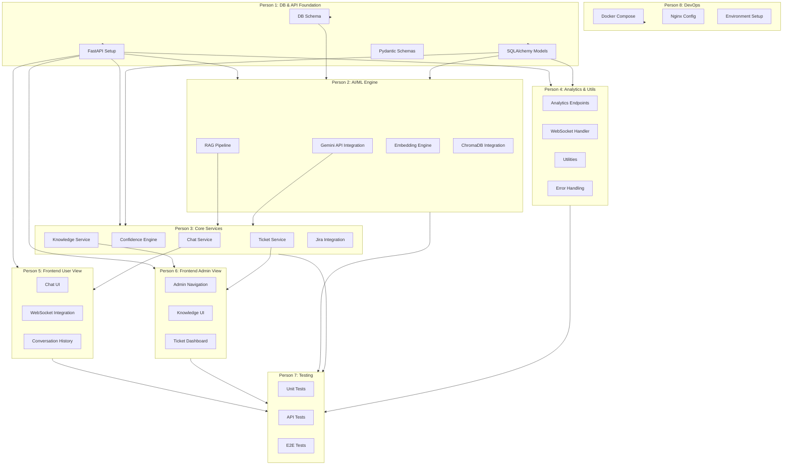

# AI-Powered L2 Support Copilot — Task Distribution Overview

## Project Summary

An AI-powered L2 Support Copilot that enables support teams to resolve customer issues faster through intelligent document understanding, contextual conversations, confidence-based decision-making, and automated ticket escalation.

**Hackathon Duration:** 24 hours
**Team Size:** 8 members
**Tech Stack:** Python FastAPI, React + TypeScript, Google Gemini API, ChromaDB, PostgreSQL, Redis, Docker

---

## Team Composition

| Role | Count | Members |
|------|-------|---------|
| Backend Engineer | 4 | Person 1, Person 2, Person 3, Person 4 |
| Frontend Engineer | 2 | Person 5, Person 6 |
| Tester | 1 | Person 7 |
| DevOps Engineer | 1 | Person 8 |

---

## Task Distribution Summary

### Person 1 — Backend: Database, Models & API Foundation

**Workstream:** Backend Infrastructure
**File:** `plans/tasks/person1-database-api-foundation.md`

| Aspect | Details |
|--------|---------|
| **Primary Focus** | Database schema design, SQLAlchemy models, FastAPI project setup, API contracts |
| **Key Deliverables** | PostgreSQL schema, all SQLAlchemy models, FastAPI app initialization, API routers, request/response schemas |
| **Dependencies** | Depends on architecture document for data models |
| **Delivers To** | Person 2, 3, 5, 7 |

**Components:**
- Database initialization scripts (init_db.sql, seed_data.sql)
- SQLAlchemy models for User, Session, Message, Ticket, KnowledgeSource, Metric
- Pydantic schemas for all request/response types
- FastAPI app with CORS, middleware, dependency injection
- API router structure (v1/chat, v1/knowledge, v1/tickets, v1/analytics)
- Database configuration and connection management

---

### Person 2 — Backend: AI/ML Engine & RAG Pipeline

**Workstream:** AI/ML Core
**File:** `plans/tasks/person2-ai-ml-engine.md`

| Aspect | Details |
|--------|---------|
| **Primary Focus** | LLM integration, embedding generation, RAG pipeline implementation |
| **Key Deliverables** | Gemini API integration, embedding engine, RAG pipeline with LangChain, text splitter |
| **Dependencies** | Depends on Person 1 for database models and API structure |
| **Delivers To** | Person 3, 7 |

**Components:**
- Google Gemini API client configuration (gemini-2.0-flash for LLM, text-embedding-004 for embeddings)
- Embedding engine for generating vector representations
- LangChain-based RAG pipeline (retrieval + generation)
- Text splitter for document chunking (500 tokens, 100 overlap)
- ChromaDB integration for vector storage and retrieval
- System prompts for LLM responses

---

### Person 3 — Backend: Core Services & External Integrations

**Workstream:** Business Logic & Integrations
**File:** `plans/tasks/person3-core-services.md`

| Aspect | Details |
|--------|---------|
| **Primary Focus** | Chat service, confidence engine, ticket service, knowledge ingestion service, Jira integration |
| **Key Deliverables** | All business logic services, Jira API integration, web crawler, confidence scoring logic |
| **Dependencies** | Depends on Person 1 (models) and Person 2 (RAG pipeline) |
| **Delivers To** | Person 5, 7 |

**Components:**
- Chat service for session and message management
- Confidence scoring engine (multi-factor: retrieval, relevance, completeness)
- Ticket escalation service with Jira Cloud API integration
- Knowledge ingestion service (web crawler, document parser)
- Analytics service for dashboard metrics
- Fallback mock Jira integration for demo reliability

---

### Person 4 — Backend: Analytics, Utilities & Testing Support

**Workstream:** Supporting Backend Services
**File:** `plans/tasks/person4-analytics-utilities.md`

| Aspect | Details |
|--------|---------|
| **Primary Focus** | Analytics endpoints, utility functions, error handling, WebSocket support, testing support |
| **Key Deliverables** | Analytics endpoints, utility modules, WebSocket handlers, comprehensive error handling |
| **Dependencies** | Depends on Person 1 (models) and Person 3 (services) |
| **Delivers To** | Person 5, 7 |

**Components:**
- Analytics endpoints (overview, trends, common issues)
- WebSocket handler for real-time chat streaming
- Utility modules (formatters, validators, helpers)
- Error handling middleware and exception handlers
- Rate limiting and retry logic
- Logging configuration
- Support tests for all backend modules

---

### Person 5 — Frontend: User View (Chat Interface)

**Workstream:** Frontend — User Experience
**File:** `plans/tasks/person5-frontend-user-view.md`

| Aspect | Details |
|--------|---------|
| **Primary Focus** | User-facing chat interface, WebSocket integration, conversation history |
| **Key Deliverables** | Complete User View with chat UI, real-time responses, conversation history, ticket notifications |
| **Dependencies** | Depends on Person 1 (API contracts) and Person 3 (chat endpoints) |
| **Delivers To** | Person 7 |

**Components:**
- React + TypeScript project setup with Vite
- React Router for routing between /user and /admin
- Chat page with message display and input
- WebSocket integration for streaming responses
- Conversation history display
- Ticket notification component
- Zustand store for user state management
- API client for backend communication
- Loading states, error boundaries, empty states

---

### Person 6 — Frontend: Admin View (Knowledge + Ticket Dashboard)

**Workstream:** Frontend — Admin Experience
**File:** `plans/tasks/person6-frontend-admin-view.md`

| Aspect | Details |
|--------|---------|
| **Primary Focus** | Admin dashboard, knowledge source management, ticket dashboard |
| **Key Deliverables** | Complete Admin View with knowledge management and ticket oversight |
| **Dependencies** | Depends on Person 1 (API contracts) and Person 3 (knowledge/ticket endpoints) |
| **Delivers To** | Person 7 |

**Components:**
- Admin layout and navigation
- Knowledge source entry form (URL input)
- Knowledge source list/table with status badges
- Ticket dashboard with filtering and sorting
- Ticket detail modal with Jira link
- Dashboard overview metrics
- Zustand store for admin state management
- API client integration
- shadcn/ui component integration

---

### Person 7 — Testing & Quality Assurance

**Workstream:** Quality Assurance
**File:** `plans/tasks/person7-testing-qa.md`

| Aspect | Details |
|--------|---------|
| **Primary Focus** | Comprehensive testing across all components, API testing, E2E testing |
| **Key Deliverables** | Unit tests, integration tests, API tests, E2E tests, test documentation |
| **Dependencies** | Depends on all backend and frontend work |
| **Delivers To** | Team (feedback loop) |

**Components:**
- Backend unit tests (services, AI engine, utilities)
- API endpoint tests (all REST endpoints)
- Frontend component tests
- WebSocket connection tests
- Confidence scoring validation tests
- E2E testing with Playwright/Cypress
- Test coverage reporting
- Bug reporting and verification

---

### Person 8 — DevOps & Infrastructure

**Workstream:** DevOps & Deployment
**File:** `plans/tasks/person8-devops-infrastructure.md`

| Aspect | Details |
|--------|---------|
| **Primary Focus** | Docker setup, CI/CD, deployment scripts, monitoring, environment configuration |
| **Key Deliverables** | Complete Docker Compose setup, container images, deployment scripts, monitoring |
| **Dependencies** | Minimal — can start immediately |
| **Delivers To** | Everyone (infrastructure) |

**Components:**
- Docker Compose orchestration (all 5 services)
- Dockerfiles for backend and frontend
- Nginx configuration for reverse proxy
- Environment variable management
- Database initialization scripts
- Demo data seeding
- Health check endpoints
- Logging and monitoring setup
- Performance tuning for demo
- Deployment documentation

---

## Dependency Graph



---

## Parallel Work Streams

### Stream A: Backend Core (Persons 1, 2, 3, 4)

```
Hour 0-2:  Person 1 sets up DB schema, models, FastAPI structure
Hour 2-4:  Person 2 starts Gemini integration + Person 3 starts service skeletons
Hour 4-8:  Person 2 builds RAG pipeline + Person 3 builds services
Hour 8-12: Person 4 adds analytics, utilities, WebSocket
Hour 12-16: Integration between all services
Hour 16-20: Bug fixes, optimization
Hour 20-24: Final polish
```

### Stream B: Frontend (Persons 5, 6)

```
Hour 0-2:  Project setup, routing, API client configuration
Hour 2-6:  Person 5 builds User View + Person 6 builds Admin View
Hour 6-10: WebSocket integration (Person 5) + Ticket detail modal (Person 6)
Hour 10-14: Polish, responsive design, error handling
Hour 14-18: Integration with backend APIs
Hour 18-22: UI/UX polish, animations
Hour 22-24: Final fixes
```

### Stream C: Infrastructure & Testing (Persons 7, 8)

```
Hour 0-2:  Person 8 sets up Docker Compose + Person 7 creates test plan
Hour 2-6:  Person 8 polishes infrastructure + Person 7 starts unit tests
Hour 6-12: Person 7 writes API tests + integration tests
Hour 12-18: Person 7 writes E2E tests
Hour 18-24: Bug fixes, demo rehearsal
```

---

## Integration Points

| Integration Point | Involved Persons | Description |
|-------------------|-----------------|-------------|
| **API Contracts** | P1, P3, P4, P5, P6 | Person 1 defines schemas; P3/P4 implement; P5/P6 consume |
| **Database Models** | P1, P2, P3, P4 | Person 1 defines; others import and use |
| **RAG Pipeline** | P2, P3 | Person 2 builds; Person 3 integrates into chat service |
| **WebSocket** | P4, P5 | Person 4 implements server-side; Person 5 consumes client-side |
| **Jira Integration** | P3, P8 | Person 3 implements API; Person 8 handles credentials |
| **Docker Setup** | P8, All | Person 8 creates; all contribute to their service configs |

---

## Communication Protocol

1. **Daily Standup (virtual):** 15-minute sync at start of each work block
2. **API Contract First:** Person 1 publishes OpenAPI spec early for frontend to mock
3. **Shared Git Repository:** Use feature branches, merge to `dev` branch
4. **Slack/Discord Channel:** Real-time communication for blockers
5. **Demo Rehearsal:** Final 2 hours reserved for full demo run-through

---

## File Structure Overview

```
semicolon/
├── plans/
│   ├── architecture.md           # Master architecture document
│   ├── task-distribution-overview.md  # This file
│   ├── tasks/
│   │   ├── person1-database-api-foundation.md
│   │   ├── person2-ai-ml-engine.md
│   │   ├── person3-core-services.md
│   │   ├── person4-analytics-utilities.md
│   │   ├── person5-frontend-user-view.md
│   │   ├── person6-frontend-admin-view.md
│   │   ├── person7-testing-qa.md
│   │   └── person8-devops-infrastructure.md
├── infra/
│   ├── docker-compose.yml        # Person 8
│   ├── Dockerfile.backend        # Person 8
│   ├── Dockerfile.frontend       # Person 8
│   └── scripts/
│       ├── init_db.sql           # Person 1
│       └── seed_data.sql         # Person 1
├── backend/                      # Persons 1, 2, 3, 4
├── frontend/                     # Persons 5, 6
├── tests/                        # Person 7
└── README.md                     # Person 8
```

---

## Success Criteria

| Criterion | Status |
|-----------|--------|
| All 8 members have clear, independent tasks | Yes |
| Tasks are balanced in complexity | Yes |
| Dependency graph is manageable | Yes |
| Demo workflow is achievable in 24 hours | Yes |
| Each task file is self-contained for AI assistance | Yes |
