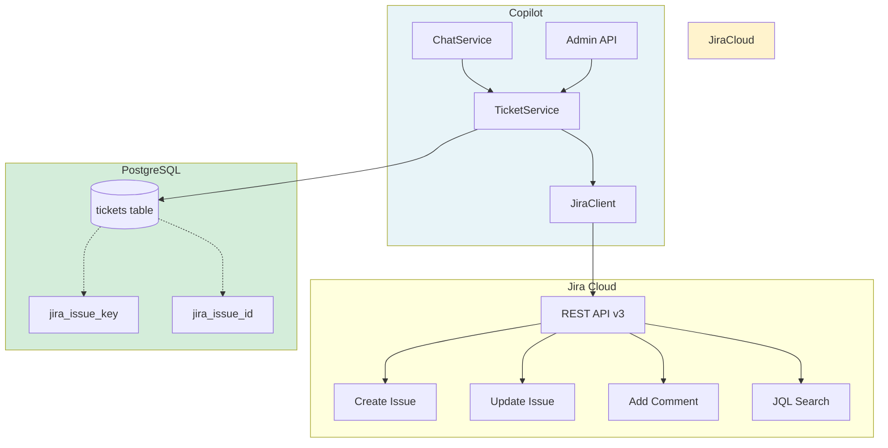
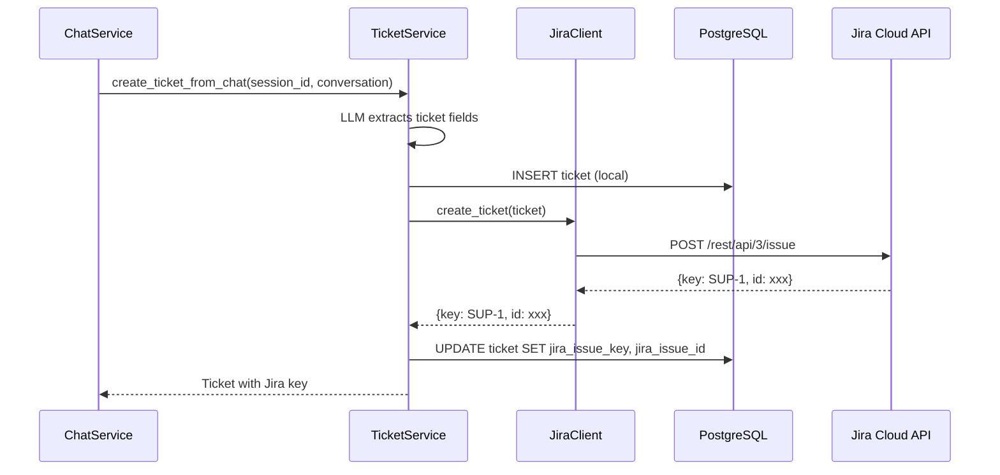
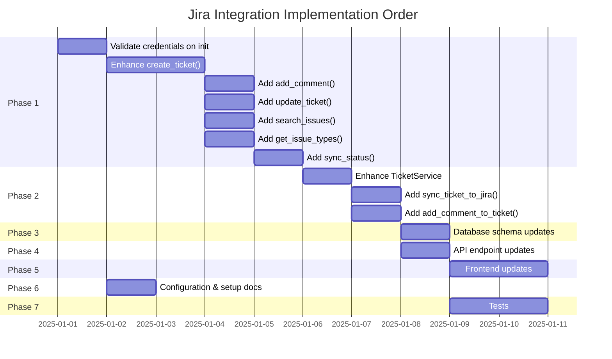

# Jira Cloud Integration — Implementation Plan

> **Purpose**: Replace the mock Jira client with a fully functional Jira Cloud API integration for the Support-Copilot system. This enables real ticket creation, status tracking, and bidirectional sync between the copilot and Jira Cloud (free tier).

---

## 1. Current State Analysis

### What Exists Today

| Component | File | Status |
|-----------|------|--------|
| Jira Client | [`jira_client.py`](backend/services/jira_client.py) | Mock fallback when `JIRA_API_TOKEN` is empty |
| Ticket Service | [`ticket_service.py`](backend/services/ticket_service.py) | Calls `JiraClient.create_ticket()`, catches exceptions gracefully |
| Ticket Model | [`ticket.py`](backend/models/ticket.py) | Stores `jira_issue_key` and `jira_issue_id` |
| Ticket API | [`tickets.py`](backend/api/v1/tickets.py) | CRUD + escalate endpoint |
| Schemas | [`schemas/ticket.py`](backend/schemas/ticket.py) | Pydantic models for request/response |
| Settings | [`settings.py`](backend/config/settings.py) | `JIRA_URL`, `JIRA_EMAIL`, `JIRA_API_TOKEN`, `JIRA_PROJECT_KEY` env vars |

### Current Limitations

1. **Mock-only mode**: When no `JIRA_API_TOKEN` is set, all calls return fake data (e.g., `SUP-ABC123`)
2. **Limited fields**: Only creates basic Task issues with summary, description, priority, labels
3. **No status sync**: Jira ticket status changes are not reflected back in the database
4. **No comment sync**: Conversations are not posted as Jira comments
5. **No issue type selection**: Hardcoded to "Task" — no Bug, Story, or custom issue types
6. **No custom fields**: Product module, environment, error messages are stored locally but not synced to Jira custom fields
7. **No search/browse**: Cannot query existing Jira issues from within the copilot
8. **No webhook support**: Jira status changes don't trigger updates in the copilot

---

## 2. Jira Cloud Free Tier — Capabilities & Constraints

### What's Available (Free Tier)

- Up to 10 users
- Standard project types (Bug, Task, Story, Improvement)
- REST API v3 access
- Webhooks (up to 25 per site)
- Custom fields and workflows
- Boards and backlogs

### Jira Cloud REST API v3 Endpoints We'll Use

| Endpoint | Method | Purpose |
|----------|--------|---------|
| `/rest/api/3/issue` | POST | Create issue |
| `/rest/api/3/issue/{issueIdOrKey}` | GET | Get issue details |
| `/rest/api/3/issue/{issueIdOrKey}` | PUT | Update issue |
| `/rest/api/3/issue/{issueIdOrKey}/comment` | POST | Add comment |
| `/rest/api/3/issue/{issueIdOrKey}/worklog` | POST | Add worklog (optional) |
| `/rest/api/3/issuetype` | GET | Fetch available issue types |
| `/rest/api/3/project/{projectKey}/fields` | GET | Fetch custom fields |
| `/rest/api/3/search` | GET | JQL search |
| `/rest/api/3/priority` | GET | Fetch priorities |

### Authentication Method

Jira Cloud uses **Email + API Token** authentication via HTTP Basic Auth:

```
Authorization: Basic base64(email:api_token)
```

The API token is generated in Atlassian Account → Security → Create and manage API tokens.

---

## 3. Implementation Architecture

### High-Level Flow



### Service Layer Updates



---

## 4. Detailed Implementation Tasks

### Phase 1: JiraClient Enhancement (Core API Integration)

**File**: [`backend/services/jira_client.py`](backend/services/jira_client.py)

#### 4.1 Validate Credentials on Init

- On `JiraClient.__init__()`, attempt a lightweight health check (`GET /rest/api/3/myself`)
- Set `self.is_configured = True/False` based on response
- Log warning if credentials are invalid but don't crash

#### 4.2 Enhance `create_ticket()` Method

**Current behavior**: Creates issue with summary, description, priority, labels

**Enhanced behavior**:
- Map all ticket fields to Jira issue fields:
  - `summary` → Jira summary
  - `description` → Jira description (Storage Format/Atlassian Document Format)
  - `severity` → Jira priority (via `_map_severity_to_priority()`)
  - `product_module` → Custom field or component
  - `environment` → Custom field or description section
  - `error_messages` → Description section
  - `steps_to_reproduce` → Description section
  - `labels` → `["copilot-escalation", source: session_id]`
- Issue type: configurable (default "Bug" for escalations, "Task" for manual)
- Return full issue JSON, not just key/id

#### 4.3 Add `get_ticket()` Enhancement

**Current behavior**: Returns partial mock data

**Enhanced behavior**:
- Fetch full issue from Jira via `GET /rest/api/3/issue/{issueIdOrKey}`
- Map Jira fields back to our internal representation
- Include status, assignee, comments count, updated_at

#### 4.4 Add `add_comment()` Method

```python
async def add_comment(self, issue_key: str, comment: str) -> dict[str, Any]
```

- POST to `/rest/api/3/issue/{issueIdOrKey}/comment`
- Supports Atlassian Document Format for rich text
- Returns created comment object

#### 4.5 Add `update_ticket()` Method

```python
async def update_ticket(
    self, 
    issue_key: str, 
    status: str | None = None,
    priority: str | None = None,
    assignee: str | None = None,
) -> dict[str, Any]
```

- PUT to `/rest/api/3/issue/{issueIdOrKey}`
- Only updates provided fields

#### 4.6 Add `search_issues()` Method

```python
async def search_issues(self, jql: str, max_results: int = 50) -> list[dict[str, Any]]
```

- POST to `/rest/api/3/search`
- Supports JQL queries
- Returns list of issues with key, summary, status, priority

#### 4.7 Add `get_issue_types()` Method

```python
async def get_issue_types(self, project_key: str | None = None) -> list[dict[str, Any]]
```

- GET `/rest/api/3/issuetype`
- Optionally filter by project
- Returns available issue types (Bug, Task, Story, etc.)

#### 4.8 Add `get_custom_fields()` Method

```python
async def get_custom_fields(self, project_key: str) -> list[dict[str, Any]]
```

- GET `/rest/api/3/project/{projectKey}/fields`
- Returns custom fields with IDs for mapping

#### 4.9 Add `get_priorities()` Method

```python
async def get_priorities(self) -> list[dict[str, Any]]
```

- GET `/rest/api/3/priority`
- Returns available priorities

#### 4.10 Add `sync_status()` Method

```python
async def sync_status(self, ticket_id: str, db: AsyncSession) -> bool
```

- Fetch current Jira status for ticket's Jira issue
- Update local `ticket.status` if different
- Returns True if updated

---

### Phase 2: TicketService Enhancements

**File**: [`backend/services/ticket_service.py`](backend/services/ticket_service.py)

#### 5.1 Enhance `create_ticket_from_chat()`

- Pass additional fields to JiraClient (product_module, environment, etc.)
- Use "Bug" as default issue type for auto-escalations
- Store full Jira response in `doc_references` JSONB field

#### 5.2 Add `sync_ticket_to_jira()` Method

```python
async def sync_ticket_to_jira(self, db: AsyncSession, ticket_id: str) -> Ticket
```

- Fetch ticket from DB
- Call `JiraClient.sync_status()` to update local status from Jira
- Refresh ticket from DB

#### 5.3 Add `add_comment_to_ticket()` Method

```python
async def add_comment_to_ticket(
    self, 
    db: AsyncSession, 
    ticket_id: str, 
    comment: str,
    source: str = "copilot"
) -> dict[str, Any] | None
```

- If ticket has `jira_issue_key`, post comment to Jira
- Store comment metadata in a new `jira_comments` JSONB field (optional)

#### 5.4 Add `list_tickets_with_jira_status()` Method

```python
async def list_tickets_with_jira_status(
    self, 
    db: AsyncSession,
    status: str | None = None,
    severity: str | None = None,
    refresh_from_jira: bool = False,
) -> list[Ticket]
```

- If `refresh_from_jira=True`, sync each ticket's status from Jira before returning

---

### Phase 3: Database Schema Updates

**File**: [`backend/models/ticket.py`](backend/models/ticket.py)

#### 6.1 Optional: Add `jira_comments` JSONB Field

```python
jira_comments: Mapped[list[dict[str, Any]] | None] = mapped_column(
    JSONB, nullable=True
)
```

Stores Jira comment metadata:
```json
[
  {
    "id": "10001",
    "body": "Comment text",
    "author": "agent@example.com",
    "created": "2025-01-15T10:30:00.000+0000",
    "source": "copilot"
  }
]
```

#### 6.2 Optional: Add `assignee` Field

```python
assignee: Mapped[str | None] = mapped_column(String(100), nullable=True)
```

Stores Jira assignee username.

---

### Phase 4: API Endpoint Updates

**File**: [`backend/api/v1/tickets.py`](backend/api/v1/tickets.py)

#### 7.1 Add `POST /tickets/{ticket_id}/comment` Endpoint

```python
@router.post("/{ticket_id}/comment", response_model=TicketCommentResponse)
async def add_ticket_comment(ticket_id: UUID, body: TicketCommentRequest, db: DbSession)
```

- Body: `{ "comment": str, "source": str = "copilot" }`
- Calls `TicketService.add_comment_to_ticket()`

#### 7.2 Add `POST /tickets/sync` Endpoint

```python
@router.post("/sync", response_model=TicketSyncResponse)
async def sync_all_tickets(db: DbSession)
```

- Syncs all tickets' status from Jira
- Returns count of updated tickets

#### 7.3 Add `GET /tickets/jira/issue-types` Endpoint

```python
@router.get("/jira/issue-types", response_model=IssueTypeListResponse)
async def get_issue_types()
```

- Returns available Jira issue types for admin selection

#### 7.4 Update `GET /tickets` to Include Jira Status

- Add optional `?refresh=true` query param
- When true, refreshes ticket status from Jira before returning

---

### Phase 5: Frontend Updates

**Files**: 
- [`frontend/src/pages/TicketsLandingPage.tsx`](frontend/src/pages/TicketsLandingPage.tsx)
- [`frontend/src/components/TicketDetail.tsx`](frontend/src/components/TicketDetail.tsx)
- [`frontend/src/store/adminStore.ts`](frontend/src/store/adminStore.ts)

#### 8.1 Display Jira Issue Key as Clickable Link

- Format: `[SUP-1](https://your-domain.atlassian.net/browse/SUP-1)`
- Opens in new tab

#### 8.2 Show Jira Status Badge

- Map Jira statuses to visual badges
- Add "Sync from Jira" button

#### 8.3 Add Comment Thread UI

- Display Jira comments in ticket detail view
- Add input to post new comment to Jira

#### 8.4 Admin: Issue Type Selector

- When manually creating a ticket, allow admin to choose issue type
- Fetch available types from `GET /tickets/jira/issue-types`

---

### Phase 6: Configuration & Environment

**Files**:
- [`backend/config/settings.py`](backend/config/settings.py)
- `.env` (root or backend directory)

#### 9.1 New Environment Variables

| Variable | Required | Description |
|----------|----------|-------------|
| `JIRA_URL` | Yes | Jira Cloud URL, e.g., `https://yourteam.atlassian.net` |
| `JIRA_EMAIL` | Yes | Email associated with Jira account |
| `JIRA_API_TOKEN` | Yes | API token from Atlassian account |
| `JIRA_PROJECT_KEY` | No | Project key (default: `SUP`) |
| `JIRA_DEFAULT_ISSUE_TYPE` | No | Default issue type for auto-escalations (default: `Bug`) |
| `JIRA_DEFAULT_ASSIGNEE` | No | Default assignee username |
| `JIRA_ENABLE_WEBHOOKS` | No | Enable webhook support (default: `false`) |

#### 9.2 Jira Setup Steps for User

1. Go to [Atlassian Account Security](https://id.atlassian.com/manage-profile/security/api-tokens)
2. Click "Create API token"
3. Name it "Support Copilot"
4. Copy the token — it won't be shown again
5. Create a Jira Cloud project (free tier)
6. Note the project key (e.g., `SUP`)
7. Add to `.env`:
   ```
   JIRA_URL=https://yourteam.atlassian.net
   JIRA_EMAIL=your-email@example.com
   JIRA_API_TOKEN=your-api-token-here
   JIRA_PROJECT_KEY=SUP
   ```

---

### Phase 7: Testing

**File**: [`backend/tests/`](backend/tests/)

#### 10.1 Unit Tests

| Test File | Tests |
|-----------|-------|
| `test_jira_client.py` | Mock Jira API responses, credential validation, error handling |
| `test_jira_client_real.py` | Integration tests against real Jira (skip if no credentials) |

#### 10.2 Test Cases for JiraClient

```python
# test_jira_client.py
- test_mock_create_ticket_returns_valid_key
- test_mock_get_ticket_returns_mock_data
- test_headers_construction_includes_credentials
- test_map_severity_to_priority_maps_all_levels

# test_jira_client_real.py (skipif not configured)
- test_create_ticket_posts_to_jira
- test_get_ticket_fetches_from_jira
- test_add_comment_posts_to_jira
- test_search_issues_returns_results
- test_update_ticket_changes_fields
- test_sync_status_updates_local_status
```

#### 10.3 Test Cases for TicketService

```python
- test_create_ticket_from_chat_calls_jira
- test_create_ticket_stores_jira_key
- test_create_ticket_handles_jira_failure_gracefully
- test_add_comment_to_ticket_calls_jira
- test_sync_ticket_updates_from_jira
```

---

## 5. Implementation Order



---

## 6. Error Handling Strategy

### Retry Logic

- All Jira API calls wrapped with retry (3 attempts, exponential backoff)
- Uses same `tenacity` decorator pattern as `LLMEngine`

### Graceful Degradation

| Scenario | Behavior |
|----------|----------|
| No JIRA_API_TOKEN | Fall back to mock mode (existing behavior) |
| Invalid credentials | Log error, set `is_configured=False`, fall back to mock |
| Jira API timeout | Log error, keep local ticket, mark `jira_synced=False` |
| Jira API rate limit | Retry after `Retry-After` header, then fall back to mock |
| Network unreachable | Keep local ticket, retry on next sync |

### New Field: `jira_synced` (Optional)

```python
jira_synced: Mapped[bool] = mapped_column(default=False)
```

Tracks whether the ticket was successfully synced to Jira. Admins can see which tickets need manual sync.

---

## 7. Security Considerations

1. **API Token Storage**: Never commit `.env` file — already in `.gitignore`
2. **Token Rotation**: Document process for rotating Jira API tokens
3. **Rate Limiting**: Jira Cloud API rate limits:
   - 300 requests/5 minutes (POST/PUT/DELETE)
   - 200 requests/minute (GET search)
   - Our rate limiter middleware should account for this
4. **Input Sanitization**: Sanitize all text before sending to Jira (prevent XSS in Jira UI)

---

## 8. Future Enhancements (Out of Scope for Phase 1)

1. **Webhook Integration**: Listen for Jira status changes and update copilot
2. **Bidirectional Sync**: Changes in copilot reflect in Jira in real-time
3. **Jira Automation Rules**: Trigger automations based on copilot escalations
4. **Time Tracking**: Log support effort as Jira worklogs
5. **SLA Tracking**: Track resolution time against Jira SLA policies
6. **Dashboard Integration**: Embed Jira board in admin view
7. **Custom Workflow**: Map copilot actions to Jira workflow transitions

---

## 9. Files Modified Summary

| File | Changes |
|------|---------|
| [`backend/services/jira_client.py`](backend/services/jira_client.py) | Major enhancement — new methods, credential validation |
| [`backend/services/ticket_service.py`](backend/services/ticket_service.py) | Enhancement — sync methods, comment support |
| [`backend/models/ticket.py`](backend/models/ticket.py) | Optional new fields: `jira_comments`, `assignee`, `jira_synced` |
| [`backend/api/v1/tickets.py`](backend/api/v1/tickets.py) | New endpoints: comment, sync, issue-types |
| [`backend/schemas/ticket.py`](backend/schemas/ticket.py) | New schemas: `TicketCommentRequest`, `TicketCommentResponse`, `IssueTypeResponse`, `TicketSyncResponse` |
| [`backend/config/settings.py`](backend/config/settings.py) | New settings: `JIRA_DEFAULT_ISSUE_TYPE`, `JIRA_DEFAULT_ASSIGNEE` |
| [`backend/tests/test_jira_client.py`](backend/tests/test_jira_client.py) | New test file |
| [`backend/tests/test_jira_client_real.py`](backend/tests/test_jira_client_real.py) | New integration test file |
| [`frontend/src/components/TicketDetail.tsx`](frontend/src/components/TicketDetail.tsx) | Jira link, status badge, comment thread |
| [`frontend/src/store/adminStore.ts`](frontend/src/store/adminStore.ts) | Add issue types, sync actions |
| `.env` | New Jira credentials |

---

*Plan created: 2026-05-13*
