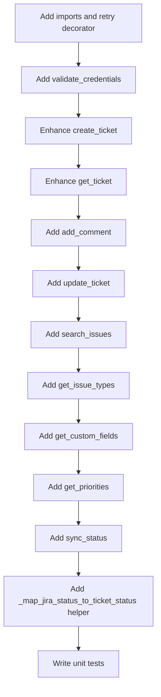

# Phase 1 Implementation Plan — JiraClient Enhancement

> **Objective**: Enhance the `JiraClient` class with full Jira Cloud REST API v3 integration while maintaining mock fallback for demo reliability.

---

## 1. Current State Analysis

### Existing [`JiraClient`](backend/services/jira_client.py) Capabilities

| Method | Status | Description |
|--------|--------|-------------|
| `__init__()` | Basic | Sets credentials, sets `use_mock = True` when `JIRA_API_TOKEN` is empty |
| `create_ticket()` | Partial | Creates issue with summary, description, priority, labels. Hardcoded to "Task" type. |
| `get_ticket()` | Partial | Returns mock data when `use_mock=True`. Real API call when configured. |
| `_headers()` | Complete | Basic Auth header construction |
| `_map_severity_to_priority()` | Complete | Maps severity to Jira priority name |
| `_mock_create_ticket()` | Complete | Returns fake SUP-XXXXXX key |

### Missing Methods (Phase 1 Scope)

| Method | Jira API Endpoint | Purpose |
|--------|-------------------|---------|
| `validate_credentials()` | `GET /rest/api/3/myself` | Health check on init |
| `add_comment()` | `POST /rest/api/3/issue/{issueIdOrKey}/comment` | Post comments to Jira issues |
| `update_ticket()` | `PUT /rest/api/3/issue/{issueIdOrKey}` | Update issue fields |
| `search_issues()` | `POST /rest/api/3/search` | JQL-based issue search |
| `get_issue_types()` | `GET /rest/api/3/issuetype` | List available issue types |
| `get_custom_fields()` | `GET /rest/api/3/project/{projectKey}/fields` | List custom fields |
| `get_priorities()` | `GET /rest/api/3/priority` | List available priorities |
| `sync_status()` | `GET /rest/api/3/issue/{issueIdOrKey}` | Sync ticket status from Jira |

---

## 2. Implementation Details

### 2.1 Credential Validation on Init

**Changes to `JiraClient.__init__()`**:

```python
async def validate_credentials(self) -> bool:
    """Validate Jira credentials by calling GET /rest/api/3/myself."""
    if self.use_mock:
        return False
    try:
        url = f"{self.base_url}/rest/api/3/myself"
        async with httpx.AsyncClient(timeout=10.0) as client:
            response = await client.get(url, headers=self._headers())
            if response.status_code == 200:
                self.is_configured = True
                logger.info("Jira credentials validated successfully")
                return True
            self.is_configured = False
            logger.warning(f"Jira credential validation failed: {response.status_code}")
            return False
    except httpx.HTTPError as exc:
        self.is_configured = False
        logger.warning(f"Jira credential validation error: {exc}")
        return False
```

**Key behaviors**:
- Sets `self.is_configured = True/False` based on response
- Logs warning if credentials invalid but doesn't crash
- Returns `False` in mock mode (no real validation possible)

---

### 2.2 Enhanced `create_ticket()` Method

**Current limitations**:
- Only maps summary, description, severity, labels
- Hardcoded `"issuetype": {"name": "Task"}`
- Does not include product_module, environment, error_messages, steps_to_reproduce

**Enhanced implementation**:

```python
async def create_ticket(
    self, 
    ticket: Any, 
    issue_type: str = "Bug"
) -> dict[str, Any]:
    """Create a Jira issue with full field mapping.
    
    Args:
        ticket: Ticket ORM instance or dict with ticket fields
        issue_type: Jira issue type (Bug, Task, Story, etc.)
    """
    if self.use_mock:
        return self._mock_create_ticket(ticket, issue_type)
    
    # Build description sections from ticket fields
    description_parts = []
    
    # Main description
    if ticket.description:
        description_parts.append({"type": "paragraph", "content": [
            {"type": "text", "text": ticket.description}
        ]})
    
    # Product Module
    product_module = getattr(ticket, "product_module", None)
    if product_module:
        description_parts.append({"type": "paragraph", "content": [
            {"type": "text", "text": f"\nProduct Module: {product_module}"}
        ]})
    
    # Environment
    environment = getattr(ticket, "environment", None)
    if environment:
        description_parts.append({"type": "paragraph", "content": [
            {"type": "text", "text": f"\nEnvironment: {environment}"}
        ]})
    
    # Error Messages
    error_messages = getattr(ticket, "error_messages", None)
    if error_messages:
        description_parts.append({"type": "paragraph", "content": [
            {"type": "text", "text": f"\nError Messages:\n{error_messages}"}
        ]})
    
    # Steps to Reproduce
    steps = getattr(ticket, "steps_to_reproduce", None)
    if steps:
        description_parts.append({"type": "paragraph", "content": [
            {"type": "text", "text": f"\nSteps to Reproduce:\n{steps}"}
        ]})
    
    url = f"{self.base_url}/rest/api/3/issue"
    headers = self._headers()
    
    payload = {
        "fields": {
            "project": {"key": self.project_key},
            "summary": (getattr(ticket, "summary", "Support escalation") or "Support escalation")[:255],
            "description": {"type": "doc", "version": 1, "content": description_parts},
            "issuetype": {"name": issue_type},
            "priority": self._map_severity_to_priority(getattr(ticket, "severity", None)),
            "labels": ["copilot-escalation"],
        }
    }
    
    # Add custom fields if they exist on the ticket
    doc_references = getattr(ticket, "doc_references", None) or {}
    if doc_references:
        payload["fields"]["labels"].extend([f"session:{doc_references.get('session_id', '')}"])
    
    async with httpx.AsyncClient(timeout=30.0) as client:
        response = await client.post(url, json=payload, headers=headers)
        response.raise_for_status()
        data = response.json()
        return {"key": data.get("key"), "id": data.get("id"), "self": data.get("self")}
```

---

### 2.3 Enhanced `get_ticket()` Method

```python
async def get_ticket(self, issue_key: str) -> dict[str, Any] | None:
    """Fetch a Jira issue by its key (e.g. SUP-123)."""
    if self.use_mock:
        return {"key": issue_key, "status": "Open", "assignee": None, "comments": []}
    
    url = f"{self.base_url}/rest/api/3/issue/{issue_key}"
    async with httpx.AsyncClient(timeout=30.0) as client:
        response = await client.get(url, headers=self._headers())
        if response.status_code == 404:
            return None
        response.raise_for_status()
        data = response.json()
        
        # Extract key fields
        fields = data.get("fields", {})
        return {
            "key": data.get("key"),
            "id": data.get("id"),
            "status": fields.get("status", {}).get("name", "Unknown"),
            "assignee": fields.get("assignee", {}).get("displayName") if fields.get("assignee") else None,
            "priority": fields.get("priority", {}).get("name") if fields.get("priority") else None,
            "updated_at": data.get("updated"),
            "comment_count": fields.get("comment", {}).get("total", 0),
        }
```

---

### 2.4 New Method: `add_comment()`

```python
async def add_comment(self, issue_key: str, comment: str) -> dict[str, Any]:
    """Add a comment to a Jira issue.
    
    Args:
        issue_key: Jira issue key (e.g., SUP-123)
        comment: Comment text (supports plain text)
    
    Returns:
        Created comment object with id, body, author, created
    """
    if self.use_mock:
        return {
            "id": str(uuid.uuid4()),
            "body": comment,
            "author": "mock-user",
            "created": datetime.now(timezone.utc).isoformat(),
        }
    
    url = f"{self.base_url}/rest/api/3/issue/{issue_key}/comment"
    headers = self._headers()
    
    payload = {
        "body": comment,
        "visibility": {"type": "role", "value": "Users"}  # Visible to all
    }
    
    async with httpx.AsyncClient(timeout=30.0) as client:
        response = await client.post(url, json=payload, headers=headers)
        response.raise_for_status()
        data = response.json()
        return {
            "id": data.get("id"),
            "body": data.get("body"),
            "author": data.get("author", {}).get("displayName"),
            "created": data.get("created"),
        }
```

---

### 2.5 New Method: `update_ticket()`

```python
async def update_ticket(
    self, 
    issue_key: str,
    status: str | None = None,
    priority: str | None = None,
    assignee: str | None = None,
    summary: str | None = None,
) -> dict[str, Any]:
    """Update a Jira issue.
    
    Args:
        issue_key: Jira issue key
        status: New status name (e.g., "In Progress", "Done")
        priority: New priority name (e.g., "High", "Medium")
        assignee: Assignee username
        summary: New summary
    
    Returns:
        Updated issue fields
    """
    if self.use_mock:
        return {"key": issue_key, "status": status or "Open"}
    
    url = f"{self.base_url}/rest/api/3/issue/{issue_key}"
    headers = self._headers()
    
    fields: dict[str, Any] = {}
    if status:
        fields["status"] = {"name": status}
    if priority:
        fields["priority"] = {"name": priority}
    if assignee:
        fields["assignee"] = {"name": assignee}
    if summary:
        fields["summary"] = summary[:255]
    
    payload = {"fields": fields}
    
    async with httpx.AsyncClient(timeout=30.0) as client:
        response = await client.put(url, json=payload, headers=headers)
        response.raise_for_status()
        data = response.json()
        return self._extract_issue_summary(data)
```

---

### 2.6 New Method: `search_issues()`

```python
async def search_issues(
    self, 
    jql: str,
    max_results: int = 50,
    fields: list[str] | None = None,
) -> list[dict[str, Any]]:
    """Search Jira issues using JQL.
    
    Args:
        jql: JQL query string (e.g., "project = SUP AND status = Open")
        max_results: Maximum results to return (default 50)
        fields: Specific fields to return (None = all)
    
    Returns:
        List of issue dicts with key, summary, status, priority
    """
    if self.use_mock:
        return []
    
    url = f"{self.base_url}/rest/api/3/search"
    headers = self._headers()
    headers["Accept"] = "application/json"
    
    payload = {
        "jql": jql,
        "maxResults": max_results,
        "fields": fields or ["summary", "status", "priority", "assignee", "created"],
    }
    
    async with httpx.AsyncClient(timeout=30.0) as client:
        response = await client.post(url, json=payload, headers=headers)
        response.raise_for_status()
        data = response.json()
        
        results = []
        for issue in data.get("issues", []):
            fields_data = issue.get("fields", {})
            results.append({
                "key": issue.get("key"),
                "id": issue.get("id"),
                "summary": fields_data.get("summary", ""),
                "status": fields_data.get("status", {}).get("name"),
                "priority": fields_data.get("priority", {}).get("name") if fields_data.get("priority") else None,
                "assignee": fields_data.get("assignee", {}).get("displayName") if fields_data.get("assignee") else None,
                "created": fields_data.get("created"),
            })
        return results
```

---

### 2.7 New Method: `get_issue_types()`

```python
async def get_issue_types(self, project_key: str | None = None) -> list[dict[str, Any]]:
    """Get available issue types.
    
    Args:
        project_key: Optional project key to filter issue types
    
    Returns:
        List of issue types with id, name, iconUrl
    """
    if self.use_mock:
        return [
            {"id": "10000", "name": "Bug", "subtask": False},
            {"id": "10001", "name": "Task", "subtask": False},
            {"id": "10002", "name": "Story", "subtask": False},
        ]
    
    url = f"{self.base_url}/rest/api/3/issuetype"
    params = {}
    if project_key:
        params["projectKey"] = project_key
    
    async with httpx.AsyncClient(timeout=15.0) as client:
        response = await client.get(url, headers=self._headers(), params=params)
        response.raise_for_status()
        data = response.json()
        
        return [
            {
                "id": it.get("id"),
                "name": it.get("name"),
                "subtask": it.get("subtask", False),
                "iconUrl": it.get("iconUrl"),
            }
            for it in data
            if not it.get("subtask")  # Exclude subtasks by default
        ]
```

---

### 2.8 New Method: `get_custom_fields()`

```python
async def get_custom_fields(self, project_key: str) -> list[dict[str, Any]]:
    """Get custom fields for a project.
    
    Args:
        project_key: Jira project key (e.g., SUP)
    
    Returns:
        List of custom fields with id, name, key
    """
    if self.use_mock:
        return []
    
    url = f"{self.base_url}/rest/api/3/project/{project_key}/fields"
    
    async with httpx.AsyncClient(timeout=15.0) as client:
        response = await client.get(url, headers=self._headers())
        response.raise_for_status()
        data = response.json()
        
        return [
            {
                "id": field.get("id"),
                "name": field.get("name"),
                "key": field.get("schema", {}).get("key"),
            }
            for field in data
            if field.get("schema", {}).get("custom")  # Only custom fields
        ]
```

---

### 2.9 New Method: `get_priorities()`

```python
async def get_priorities(self) -> list[dict[str, Any]]:
    """Get available priorities.
    
    Returns:
        List of priorities with id, name, iconUrl
    """
    if self.use_mock:
        return [
            {"id": "10000", "name": "Highest", "iconUrl": "..."},
            {"id": "10001", "name": "High", "iconUrl": "..."},
            {"id": "10002", "name": "Medium", "iconUrl": "..."},
            {"id": "10003", "name": "Low", "iconUrl": "..."},
            {"id": "10004", "name": "Lowest", "iconUrl": "..."},
        ]
    
    url = f"{self.base_url}/rest/api/3/priority"
    
    async with httpx.AsyncClient(timeout=15.0) as client:
        response = await client.get(url, headers=self._headers())
        response.raise_for_status()
        data = response.json()
        
        return [
            {
                "id": p.get("id"),
                "name": p.get("name"),
                "iconUrl": p.get("iconUrl"),
            }
            for p in data
        ]
```

---

### 2.10 New Method: `sync_status()`

```python
async def sync_status(
    self, 
    ticket_id: str, 
    db: Any  # AsyncSession
) -> bool:
    """Sync ticket status from Jira to local database.
    
    Args:
        ticket_id: Local ticket UUID
        db: Database session
    
    Returns:
        True if status was updated, False otherwise
    """
    if self.use_mock:
        return False
    
    # Import here to avoid circular imports
    from sqlalchemy import select
    from models.ticket import Ticket
    
    stmt = select(Ticket).where(Ticket.id == ticket_id)
    result = await db.execute(stmt)
    ticket = result.scalar_one_or_none()
    
    if not ticket or not ticket.jira_issue_key:
        logger.warning(f"Ticket {ticket_id} not found or has no Jira key")
        return False
    
    jira_data = await self.get_ticket(ticket.jira_issue_key)
    if not jira_data:
        logger.warning(f"Could not fetch Jira issue {ticket.jira_issue_key}")
        return False
    
    # Map Jira status to our TicketStatus enum
    jira_status = jira_data.get("status", "")
    new_status = self._map_jira_status_to_ticket_status(jira_status)
    
    if new_status and new_status != ticket.status:
        ticket.status = new_status
        await db.commit()
        logger.info(f"Updated ticket {ticket_id} status from {ticket.status} to {new_status}")
        return True
    
    return False


def _map_jira_status_to_ticket_status(self, jira_status: str) -> str | None:
    """Map Jira status name to our TicketStatus enum value."""
    mapping = {
        "To Do": TicketStatus.open.value,
        "In Progress": TicketStatus.in_progress.value,
        "In Review": TicketStatus.in_progress.value,
        "Done": TicketStatus.resolved.value,
        "Closed": TicketStatus.closed.value,
        "Resolved": TicketStatus.resolved.value,
    }
    return mapping.get(jira_status)
```

---

### 2.11 Retry Logic with Tenacity

All Jira API methods should be wrapped with tenacity retry decorator:

```python
from tenacity import retry, stop_after_attempt, wait_exponential, retry_if_exception_type, retry_if_exception

@retry(
    stop=stop_after_attempt(3),
    wait=wait_exponential(multiplier=2, min=2, max=10),
    retry=retry_if_exception_type((httpx.HTTPError, httpx.ConnectError)),
    reraise=True,
)
async def create_ticket(self, ticket: Any, issue_type: str = "Bug") -> dict[str, Any]:
    # ... method body ...
```

This pattern applies to all methods that make HTTP requests.

---

## 3. Files to Modify

| File | Changes |
|------|---------|
| [`backend/services/jira_client.py`](backend/services/jira_client.py) | Major enhancement — add 8 new methods, enhance 2 existing, add retry logic |
| [`backend/tests/test_jira_client.py`](backend/tests/test_jira_client.py) | **New file** — unit tests for all JiraClient methods |

---

## 4. Test Plan

### New Test File: `backend/tests/test_jira_client.py`

| Test | Description |
|------|-------------|
| `test_mock_create_ticket_returns_valid_key` | Mock mode returns SUP-XXXXXX key |
| `test_mock_get_ticket_returns_mock_data` | Mock mode returns mock data |
| `test_headers_construction_includes_credentials` | Headers have correct Basic Auth |
| `test_map_severity_to_priority_maps_all_levels` | All severity levels map correctly |
| `test_mock_add_comment_returns_mock_data` | Mock mode returns mock comment |
| `test_mock_update_ticket_returns_mock_data` | Mock mode returns mock update |
| `test_mock_search_issues_returns_empty` | Mock mode returns empty list |
| `test_mock_get_issue_types_returns_defaults` | Mock mode returns default issue types |
| `test_mock_get_priorities_returns_defaults` | Mock mode returns default priorities |
| `test_mock_sync_status_returns_false` | Mock mode returns False |
| `test_validate_credentials_returns_false_when_mock` | Mock mode validation returns False |
| `test_create_ticket_with_all_fields` | Test enhanced field mapping |
| `test_search_issues_jql_construction` | Test JQL query construction |
| `test_update_ticket_partial_fields` | Test updating only some fields |

---

## 5. Implementation Order



---

## 6. New Dependencies

No new Python dependencies required. The existing `tenacity==8.2.3` in [`requirements.txt`](backend/requirements.txt:28) is already available for retry logic. `httpx==0.28.1` is already available for HTTP requests.

---

## 7. Backward Compatibility

All changes maintain backward compatibility:

1. **`create_ticket(ticket)`** — The `issue_type` parameter defaults to `"Bug"` but existing callers without this parameter will work (they'll need to be updated to pass the parameter explicitly for the new behavior)
2. **`get_ticket(issue_key)`** — Returns extended dict with additional keys; existing code accessing `key` and `status` continues to work
3. **Mock mode unchanged** — All mock methods return compatible data structures
4. **`_headers()`, `_map_severity_to_priority()`** — No changes to existing behavior

---

## 8. Environment Variables (No Changes Required)

The existing environment variables in [`settings.py`](backend/config/settings.py:28-31) are sufficient:

| Variable | Current Default | Used By |
|----------|----------------|---------|
| `JIRA_URL` | `""` | All methods |
| `JIRA_EMAIL` | `""` | `_headers()` |
| `JIRA_API_TOKEN` | `""` | `__init__()` (mock detection) |
| `JIRA_PROJECT_KEY` | `"SUP"` | `create_ticket()`, `get_custom_fields()` |

No new environment variables needed for Phase 1.
